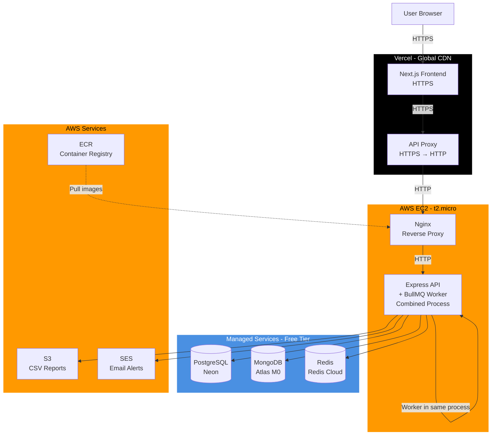

# SentinelCloud - Scalable Uptime Monitoring System

A production-ready uptime monitoring system built with modern technologies, featuring real-time alerts, performance metrics, and a beautiful dashboard. Perfect for monitoring websites, APIs, and services with enterprise-grade reliability.

**🌐 Live Demo:** [https://sentinelcloud.vercel.app](https://sentinelcloud.vercel.app)  
**💰 Cost:** $0/month (100% free tier)  
**⚡ Performance:** 10% RAM usage on t2.micro, global CDN, <100ms API response

## 🏗️ Architecture

The system uses a modern, cloud-native architecture optimized for the free tier:

- **Client**: Next.js dashboard deployed on Vercel with global CDN, automatic HTTPS, and API proxy for secure communication with the backend.
- **API & Monitoring Engine**: Express API on AWS EC2 that handles auth, monitor CRUD, metrics aggregation, CSV export, API keys, and exposes public/system status endpoints. Background workers run in the same process for efficiency.
- **Background Workers**: BullMQ workers combined with the API process, running heartbeat checks every 60 seconds, writing ping logs to MongoDB, and firing alert/recovery notifications.
- **Data Layer**: 
  - **PostgreSQL (Neon)**: User accounts, monitor configurations, refresh tokens, API keys
  - **MongoDB (Atlas)**: High-volume time-series ping logs with optimized queries
  - **Redis (Redis Cloud)**: Rate limiting, caching, and BullMQ job queues
- **Infrastructure**: Nginx reverse proxy on EC2, Docker containers for API, GitHub Actions CI/CD pipeline, AWS services (EC2, ECR, S3, SES). Optimized to run on t2.micro (1GB RAM) with ~10% memory usage.




## ✨ Features

### Core Monitoring
- **Heartbeat Checker**: Background service that pings user-provided URLs every 60 seconds
- **Performance Metrics**: Captures response times and status codes (200, 404, 500, etc.)
- **Real-time Visualization**: Interactive charts showing uptime percentage and response time trends
- **Status Badges**: Public SVG badges for each monitor (like `status.yourstartup.com`)

### Alerting System
- **Email Alerts**: AWS SES integration for email notifications when sites go down
- **Webhook Support**: Discord/Slack webhook integration for instant notifications
- **Configurable Thresholds**: Customize alert conditions per monitor

### Advanced Engineering Features
- **Redis Integration**: 
  - Rate limiting to prevent API abuse
  - Task queue (BullMQ) for background ping jobs
- **Dual Database Design**:
  - **PostgreSQL** (via Drizzle ORM): User accounts, monitor configurations, refresh tokens, API keys
  - **MongoDB**: High-volume ping logs with optimized time-series queries
- **Authentication**: 
  - JWT access tokens (15-minute expiry)
  - Refresh tokens stored in HTTP-only cookies
  - Secure token rotation and revocation
- **Security Hardening**:
  - Helmet for secure HTTP headers
  - CSRF protection on state-changing routes
  - XSS sanitization and input validation with Zod
- **S3 Integration**: Export CSV reports and store user-generated content
  - Avatar uploads for user profiles (optional, when S3 is configured)

### Infrastructure & DevOps
- **Cloud-Native Architecture**:
  - Frontend: Vercel (global CDN, automatic HTTPS, serverless API proxy)
  - Backend: AWS EC2 t2.micro with Docker (API + Nginx)
  - Databases: Managed services (Neon PostgreSQL, MongoDB Atlas, Redis Cloud)
- **Optimized for Free Tier**:
  - EC2 RAM usage: ~100 MB (10% of 1GB) - can handle 50-100 users
  - All services on free tier: $0/month
  - Worker combined with API process for efficiency
- **CI/CD Pipeline**: 
  - GitHub Actions for API builds and EC2 deployment
  - Vercel auto-deploys frontend on every push
  - Automated testing, Docker image builds, and ECR pushes
- **Security**: HTTPS via Vercel, API proxy for mixed content prevention, Nginx reverse proxy, CORS protection

## ⚡ Performance & Optimization

This project is optimized to run on minimal resources while maintaining production-grade performance:

### Resource Usage (EC2 t2.micro - 1GB RAM)
- **RAM Usage**: ~100 MB (10%) - down from 580 MB through optimization
- **Disk Usage**: ~2.5 GB (37%) - efficient container management
- **Containers**: 2 (API + Nginx) - worker combined with API process
- **Capacity**: Can handle 50-100 concurrent users on free tier

### Optimization Techniques
1. **Managed Databases**: MongoDB Atlas and Redis Cloud (free tiers) instead of self-hosted
2. **Combined Processes**: Worker runs in same Node.js process as API
3. **CDN Frontend**: Vercel global CDN for fast page loads worldwide
4. **HTTPS Proxy**: Vercel serverless functions proxy API calls (HTTPS → HTTP)
5. **Efficient Builds**: Multi-stage Docker builds, ECR image caching

### Cost Breakdown
| Service | Tier | Monthly Cost |
|---------|------|--------------|
| Frontend (Vercel) | Free | $0 |
| Backend (EC2 t2.micro) | Free Tier | $0 |
| PostgreSQL (Neon) | Free | $0 |
| MongoDB (Atlas M0) | Free | $0 |
| Redis (Redis Cloud) | Free 30MB | $0 |
| AWS S3 | Free Tier | $0 |
| AWS SES | Free Tier | $0 |
| **Total** | | **$0/month** |

## 🚀 Quick Start

### Prerequisites

- Node.js 18+ and npm
- Docker and Docker Compose
- PostgreSQL (Neon.tech free tier recommended)
- MongoDB (Atlas free tier recommended)
- Redis (Redis Cloud free tier or local)

### Quick Start

1. **Clone the repository**
   ```bash
   git clone <your-repo-url>
   cd SentinelCloud
   ```

2. **Set up databases** (Detailed guide: [SETUP.md](./SETUP.md))
   - Create PostgreSQL database on [Neon.tech](https://neon.tech)
   - Create MongoDB database on [Atlas](https://www.mongodb.com/cloud/atlas)
   - Set up Redis on [Redis Cloud](https://redis.com/try-free/) or locally

3. **Configure environment variables**
   ```bash
   cp .env.example .env
   # Edit .env with your database connection strings (see SETUP.md for details)
   ```

3. **Install dependencies**
   ```bash
   npm install
   ```

4. **Start services with Docker Compose**
   ```bash
   docker-compose up -d
   ```

5. **Run database migrations** (PostgreSQL schema will be created automatically on first run)

6. **Access the application**
   - Frontend: http://localhost:3000
   - API: http://localhost:4000
   - API Health: http://localhost:4000/health

### Environment Variables

See `.env.example` for all required variables. For detailed database setup instructions, see [SETUP.md](./SETUP.md).

**Required variables:**
- `POSTGRES_URL`: PostgreSQL connection string (Neon.tech)
- `MONGODB_URI`: MongoDB connection string (Atlas)
- `REDIS_URL`: Redis connection string
- `JWT_SECRET`: Secret key for JWT tokens (min 32 characters) - generate with `openssl rand -base64 32`
- `FRONTEND_URL`: Base URL for the web app (used in password reset links, defaults to `http://localhost:3000`)

**Important defaults (can be overridden):**
- `JWT_ACCESS_EXPIRES_IN`: Access token TTL (default `15m`)
- `JWT_REFRESH_EXPIRES_IN`: Refresh token TTL (default `7d`)
- `RATE_LIMIT_WINDOW_MS`: Rate limit window (default 15 minutes)
- `RATE_LIMIT_MAX_REQUESTS`: Requests per window (default 100)
- `PASSWORD_RESET_TOKEN_EXPIRY`: Password reset token TTL in ms (default 1 hour)

**Optional (for production):**
- `AWS_ACCESS_KEY_ID` / `AWS_SECRET_ACCESS_KEY`: AWS credentials
- `SES_FROM_EMAIL`: Verified email address for SES
- `S3_BUCKET_NAME`: S3 bucket for reports

### Troubleshooting

**MongoDB connection: `querySrv ECONNREFUSED _mongodb._tcp.*.mongodb.net`**

This usually means DNS cannot resolve the MongoDB Atlas SRV hostname. Try:

- **Network**: Ensure your network or VPN allows outbound DNS (UDP/TCP 53) and connections to `*.mongodb.net`.
- **DNS**: Use a different DNS (e.g. 8.8.8.8 or 1.1.1.1) or try from another network.
- **Atlas**: In MongoDB Atlas, use the “Connect” → “Drivers” connection string and pick the **standard hostname list** (e.g. `cluster0.xxxxx.mongodb.net`) instead of the SRV format, and put it in `MONGODB_URI`.

**Status page shows 404**

Ensure the API server is running and has been restarted after pulling the latest code (the `/api/public/status` route must be registered). Run the API with `npm run dev` in `apps/api`.

## 📁 Project Structure

```
SentinelCloud/
├── apps/
│   ├── api/                 # Express API (Monitoring Engine)
│   │   ├── src/
│   │   │   ├── config/      # Environment configuration
│   │   │   ├── db/          # Database connections & schemas
│   │   │   ├── middleware/  # Auth, rate limiting
│   │   │   ├── routes/      # API routes
│   │   │   ├── services/    # Business logic (auth, alerts)
│   │   │   ├── queues/      # BullMQ queue definitions
│   │   │   ├── workers/     # Background job workers
│   │   │   ├── index.ts     # API server entry
│   │   │   └── worker.ts    # Worker process entry
│   │   └── Dockerfile
│   └── web/                 # Next.js Dashboard
│       ├── src/
│       │   ├── app/         # Next.js app router pages
│       │   ├── lib/          # API client, auth context
│       │   └── components/  # React components
│       └── Dockerfile
├── infra/
│   └── nginx/               # Nginx configuration
├── .github/
│   └── workflows/
│       └── deploy.yml       # CI/CD pipeline
├── docker-compose.yml       # Local development orchestration
└── package.json             # Monorepo workspace config
```

## 🗄️ Database Design

### PostgreSQL (Drizzle ORM)
- **users**: User accounts and authentication
- **monitors**: Monitor configurations (URL, name, alert settings)
- **refresh_tokens**: JWT refresh token storage
- **api_keys**: Hashed API keys for programmatic access

### MongoDB
- **ping_logs**: High-volume time-series data
  - Indexed on `(monitorId, timestamp)` for efficient queries
  - Stores: `monitorId`, `timestamp`, `statusCode`, `responseTimeMs`, `success`

**Why SQL vs NoSQL?**
- PostgreSQL: Relational data (users, monitors) requiring transactions and referential integrity
- MongoDB: Append-only time-series data with high write volume, optimized for range queries

## 🔐 Authentication Flow

1. **Login**: User provides email/password
2. **Server Response**: 
   - Access token (JWT, 15 min) in response body
   - Refresh token (opaque, 7 days) in HTTP-only cookie
3. **API Requests**: Access token sent in `Authorization: Bearer` header
4. **Token Refresh**: On 401, client calls `/api/auth/refresh` with cookie
5. **Logout**: Refresh token revoked server-side, cookie cleared
6. **Password Reset**: `/api/auth/forgot-password`, `/api/auth/reset-password`, and `/api/auth/verify-reset-token` support secure password reset flows backed by signed, expiring tokens.
7. **CSRF Protection**: State-changing routes (e.g. creating monitors, managing API keys, profile updates) require a CSRF token obtained from `/api/auth/csrf-token`.

## 🔄 CI/CD Pipeline

### Dual Deployment Pipeline

**Frontend (Vercel):**
- Auto-deploys on every push to `main`
- Builds Next.js with API proxy
- Deploys to global CDN with HTTPS
- Preview deployments for PRs

**Backend (GitHub Actions → EC2):**
1. **Test**: Runs `npm test` across all workspaces
2. **Build**: Builds Docker image for `api` (includes combined worker)
3. **Push**: Pushes to Amazon ECR with tags `latest` and `{git-sha}`
4. **Deploy**: SSHs to EC2, copies config files, pulls images, restarts containers

**Required GitHub Secrets:**
- `AWS_ACCESS_KEY_ID`
- `AWS_SECRET_ACCESS_KEY`
- `EC2_HOST`
- `EC2_USER`
- `EC2_SSH_KEY`

**Deployment Time:** ~5 minutes total (Vercel: 2-3 min, EC2: 3-5 min)

## ☁️ Production Deployment

### Architecture Overview

**Frontend:** Vercel (HTTPS, global CDN)  
**Backend:** AWS EC2 t2.micro (HTTP, proxied through Vercel)  
**Databases:** Managed services (Neon, Atlas, Redis Cloud)

### EC2 Setup (Backend)

1. **Launch EC2 Instance**
   - Instance type: `t2.micro` (Free Tier, 1GB RAM)
   - OS: Ubuntu 24.04 LTS
   - Region: `ap-south-1` (Mumbai) or your preferred region
   - Security Group: Allow ports 22 (SSH), 80 (HTTP)

2. **Install Dependencies**
   ```bash
   sudo apt update
   sudo apt install docker.io docker-compose git -y
   sudo usermod -aG docker ubuntu
   ```

3. **Setup Application**
   ```bash
   git clone <your-repo-url> /opt/sentinelcloud
   cd /opt/sentinelcloud
   nano .env  # Add production values
   ```

4. **Start Services**
   ```bash
   docker-compose pull
   docker-compose up -d
   ```

### Vercel Setup (Frontend)

1. **Import Project**
   - Go to https://vercel.com/new
   - Import your GitHub repository
   - Root Directory: `apps/web`

2. **Configure Environment**
   - Add: `API_URL=http://YOUR_EC2_IP`
   - Deploy

3. **Result**
   - Frontend: `https://your-project.vercel.app`
   - Automatic HTTPS, global CDN, auto-deployments


**S3 (CSV Exports):**
- Create bucket in same region as EC2
- Configure IAM permissions
- Set `S3_BUCKET_NAME` in `.env`

**SES (Email Alerts):**
- Verify sender email/domain
- Request production access (optional)
- Set `SES_FROM_EMAIL` in `.env`

**Note:** SES sandbox mode works for demos (verified emails only)

### Monitoring & Alerts

**CRITICAL**: Set up a budget alert to avoid unexpected charges:

1. Go to AWS Billing Dashboard
2. Create a budget for $0.01
3. Configure email alerts when usage hits 1 cent
4. This ensures you stay within Free Tier limits

## 🛠️ Tech Stack

| Category | Technology |
|----------|-----------|
| **Frontend** | Next.js 14 (App Router), React, TypeScript, Tailwind CSS, Recharts |
| **Deployment** | Vercel (frontend), AWS EC2 (backend) |
| **Backend** | Node.js, Express, TypeScript |
| **Databases** | PostgreSQL (Neon + Drizzle ORM), MongoDB (Atlas) |
| **Cache/Queue** | Redis (Redis Cloud), BullMQ |
| **Authentication** | JWT, HTTP-only cookies, bcrypt, CSRF tokens |
| **Infrastructure** | Docker, Nginx, GitHub Actions CI/CD |
| **Cloud Services** | AWS (EC2, ECR, S3, SES) |
| **Security** | Helmet, CORS, XSS sanitization, rate limiting |
| **Monitoring** | Custom ping system with email/webhook alerts |

## 📊 API Endpoints

### Authentication
- `POST /api/auth/register` - Register new user
- `POST /api/auth/login` - Login (returns access token, sets refresh cookie)
- `POST /api/auth/refresh` - Refresh access token
- `POST /api/auth/logout` - Logout (revokes refresh token)

### Monitors
- `GET /api/monitors` - List user's monitors
- `GET /api/monitors/:id` - Get monitor details
- `POST /api/monitors` - Create new monitor
- `PATCH /api/monitors/:id` - Update monitor
- `DELETE /api/monitors/:id` - Delete monitor

### Metrics
- `GET /api/metrics/:monitorId` - Get ping logs
- `GET /api/metrics/:monitorId/stats` - Get aggregated statistics

### Export
- `POST /api/export/csv/:monitorId` - Export CSV report (uploads to S3)
- `GET /api/export/presigned-url/:s3Key` - Get presigned download URL

### Public Status & Badges
- `GET /api/public/status` - Overall system health (API, workers, databases)
- `GET /api/public/monitors/:monitorId/status` - Public JSON status for a single monitor
- `GET /status/:monitorId` (Next.js page) - Human-friendly public status page
- `GET /api/status/:monitorId` (Next.js route) - Public SVG badge for embedding in READMEs or dashboards

### API Keys
- `POST /api/api-keys` - Create a new API key (returns the plain key once)
- `GET /api/api-keys` - List and inspect existing API keys
- `DELETE /api/api-keys/:id` - Revoke an API key

## 🎯 Comparison: Why This Beats a "Social Media Clone"

| Feature | Social Media Clone | SentinelCloud |
|---------|-------------------|---------------|
| **Logic** | Simple CRUD | Real-time background tasks & status checking |
| **Complexity** | UI-focused | Backend/Infrastructure focused |
| **AWS Usage** | Maybe S3 for images | EC2, SES, ECR, CloudWatch logs, S3 |
| **Interview Value** | "I can build a UI" | "I can build a scalable, reliable system" |
| **Engineering Skills** | Basic REST API | Task queues, rate limiting, dual databases, CI/CD |

## 🆓 Free Tier Strategy

This project is designed to run **entirely free** using:

- **AWS Free Tier**: EC2 (750 hrs/month), S3 (5GB), SES (generous limits)
- **MongoDB Atlas**: M0 Sandbox (Free Forever, 512MB-5GB)
- **PostgreSQL**: Neon.tech Free Tier
- **Redis Cloud**: 30MB Free Tier
- **GitHub Actions**: Free for public repos
- **Docker Hub**: Unlimited public repos
- **Let's Encrypt**: Free SSL certificates

**⚠️ Important**: Set up AWS Budget alerts ($0.01) to avoid unexpected charges!

## 📝 License

MIT License - feel free to use this project for your portfolio or learning.

## 🤝 Contributing

Contributions welcome! Please open an issue or submit a pull request.

## 📧 Support

For questions or issues, please open a GitHub issue.

---

**Built with ❤️ for demonstrating production-ready engineering skills**
