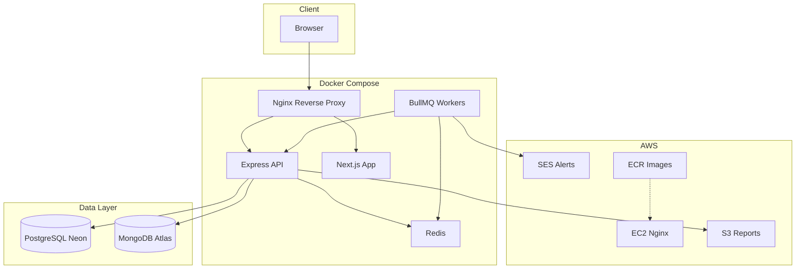

# SentinelCloud - Scalable Uptime Monitoring System

A production-ready uptime monitoring system built with modern technologies, featuring real-time alerts, performance metrics, and a beautiful dashboard. Perfect for monitoring websites, APIs, and services with enterprise-grade reliability.

## 🏗️ Architecture

The system is split into five main parts:

- **Client**: A browser-based dashboard (Next.js) where users manage monitors, view uptime charts, configure alerts, and view status pages/badges.
- **API & Monitoring Engine**: An Express API that handles auth, monitor CRUD, metrics aggregation, CSV export, API keys, and exposes public/system status endpoints.
- **Background Workers**: BullMQ workers that run heartbeat checks every 60 seconds, write ping logs to MongoDB, and fire alert/recovery notifications.
- **Data Layer**: PostgreSQL (Neon or any managed Postgres) for relational data such as users, monitors, refresh tokens, and API keys; MongoDB (Atlas or local Mongo) for high-volume time-series ping logs.
- **Infrastructure**: Redis for rate limiting and BullMQ queues, Nginx as a reverse proxy, Docker Compose for local orchestration (including MongoDB + Redis containers), and AWS services (EC2, ECR, S3, SES) for production deployment.




## ✨ Features

### Core Monitoring
- **Heartbeat Checker**: Background service that pings user-provided URLs every 60 seconds
- **Performance Metrics**: Captures response times and status codes (200, 404, 500, etc.)
- **Real-time Visualization**: Interactive charts showing uptime percentage and response time trends
- **Status Badges**: Public SVG badges for each monitor (like `status.yourstartup.com`)

### Alerting System
- **Email Alerts**: AWS SES integration for email notifications when sites go down
- **Webhook Support**: Discord/Slack webhook integration for instant notifications
- **Configurable Thresholds**: Customize alert conditions per monitor

### Advanced Engineering Features
- **Redis Integration**: 
  - Rate limiting to prevent API abuse
  - Task queue (BullMQ) for background ping jobs
- **Dual Database Design**:
  - **PostgreSQL** (via Drizzle ORM): User accounts, monitor configurations, refresh tokens, API keys
  - **MongoDB**: High-volume ping logs with optimized time-series queries
- **Authentication**: 
  - JWT access tokens (15-minute expiry)
  - Refresh tokens stored in HTTP-only cookies
  - Secure token rotation and revocation
- **Security Hardening**:
  - Helmet for secure HTTP headers
  - CSRF protection on state-changing routes
  - XSS sanitization and input validation with Zod
- **S3 Integration**: Export CSV reports and store user-generated content
  - Avatar uploads for user profiles (optional, when S3 is configured)

### Infrastructure & DevOps
- **Docker Compose**: Complete local development environment
- **CI/CD Pipeline**: GitHub Actions that run tests, build Docker images, and push to Amazon ECR
- **AWS Deployment**: 
  - EC2 with Nginx reverse proxy
  - S3 for report storage
  - SES for email alerts
  - ECR for container registry
- **Free Tier Optimized**: Designed to run entirely on AWS Free Tier and free services

## 🚀 Quick Start

### Prerequisites

- Node.js 18+ and npm
- Docker and Docker Compose
- PostgreSQL (Neon.tech free tier recommended)
- MongoDB (Atlas free tier recommended)
- Redis (Redis Cloud free tier or local)

### Quick Start

1. **Clone the repository**
   ```bash
   git clone <your-repo-url>
   cd SentinelCloud
   ```

2. **Set up databases** (Detailed guide: [SETUP.md](./SETUP.md))
   - Create PostgreSQL database on [Neon.tech](https://neon.tech)
   - Create MongoDB database on [Atlas](https://www.mongodb.com/cloud/atlas)
   - Set up Redis on [Redis Cloud](https://redis.com/try-free/) or locally

3. **Configure environment variables**
   ```bash
   cp .env.example .env
   # Edit .env with your database connection strings (see SETUP.md for details)
   ```

3. **Install dependencies**
   ```bash
   npm install
   ```

4. **Start services with Docker Compose**
   ```bash
   docker-compose up -d
   ```

5. **Run database migrations** (PostgreSQL schema will be created automatically on first run)

6. **Access the application**
   - Frontend: http://localhost:3000
   - API: http://localhost:4000
   - API Health: http://localhost:4000/health

### Environment Variables

See `.env.example` for all required variables. For detailed database setup instructions, see [SETUP.md](./SETUP.md).

**Required variables:**
- `POSTGRES_URL`: PostgreSQL connection string (Neon.tech)
- `MONGODB_URI`: MongoDB connection string (Atlas)
- `REDIS_URL`: Redis connection string
- `JWT_SECRET`: Secret key for JWT tokens (min 32 characters) - generate with `openssl rand -base64 32`
- `FRONTEND_URL`: Base URL for the web app (used in password reset links, defaults to `http://localhost:3000`)

**Important defaults (can be overridden):**
- `JWT_ACCESS_EXPIRES_IN`: Access token TTL (default `15m`)
- `JWT_REFRESH_EXPIRES_IN`: Refresh token TTL (default `7d`)
- `RATE_LIMIT_WINDOW_MS`: Rate limit window (default 15 minutes)
- `RATE_LIMIT_MAX_REQUESTS`: Requests per window (default 100)
- `PASSWORD_RESET_TOKEN_EXPIRY`: Password reset token TTL in ms (default 1 hour)

**Optional (for production):**
- `AWS_ACCESS_KEY_ID` / `AWS_SECRET_ACCESS_KEY`: AWS credentials
- `SES_FROM_EMAIL`: Verified email address for SES
- `S3_BUCKET_NAME`: S3 bucket for reports

For step-by-step AWS setup (S3, SES, IAM, free tier, and profile images), see [docs/AWS-SETUP.md](./docs/AWS-SETUP.md).

### Troubleshooting

**MongoDB connection: `querySrv ECONNREFUSED _mongodb._tcp.*.mongodb.net`**

This usually means DNS cannot resolve the MongoDB Atlas SRV hostname. Try:

- **Network**: Ensure your network or VPN allows outbound DNS (UDP/TCP 53) and connections to `*.mongodb.net`.
- **DNS**: Use a different DNS (e.g. 8.8.8.8 or 1.1.1.1) or try from another network.
- **Atlas**: In MongoDB Atlas, use the “Connect” → “Drivers” connection string and pick the **standard hostname list** (e.g. `cluster0.xxxxx.mongodb.net`) instead of the SRV format, and put it in `MONGODB_URI`.

**Status page shows 404**

Ensure the API server is running and has been restarted after pulling the latest code (the `/api/public/status` route must be registered). Run the API with `npm run dev` in `apps/api`.

## 📁 Project Structure

```
SentinelCloud/
├── apps/
│   ├── api/                 # Express API (Monitoring Engine)
│   │   ├── src/
│   │   │   ├── config/      # Environment configuration
│   │   │   ├── db/          # Database connections & schemas
│   │   │   ├── middleware/  # Auth, rate limiting
│   │   │   ├── routes/      # API routes
│   │   │   ├── services/    # Business logic (auth, alerts)
│   │   │   ├── queues/      # BullMQ queue definitions
│   │   │   ├── workers/     # Background job workers
│   │   │   ├── index.ts     # API server entry
│   │   │   └── worker.ts    # Worker process entry
│   │   └── Dockerfile
│   └── web/                 # Next.js Dashboard
│       ├── src/
│       │   ├── app/         # Next.js app router pages
│       │   ├── lib/          # API client, auth context
│       │   └── components/  # React components
│       └── Dockerfile
├── infra/
│   └── nginx/               # Nginx configuration
├── .github/
│   └── workflows/
│       └── deploy.yml       # CI/CD pipeline
├── docker-compose.yml       # Local development orchestration
└── package.json             # Monorepo workspace config
```

## 🗄️ Database Design

### PostgreSQL (Drizzle ORM)
- **users**: User accounts and authentication
- **monitors**: Monitor configurations (URL, name, alert settings)
- **refresh_tokens**: JWT refresh token storage
- **api_keys**: Hashed API keys for programmatic access

### MongoDB
- **ping_logs**: High-volume time-series data
  - Indexed on `(monitorId, timestamp)` for efficient queries
  - Stores: `monitorId`, `timestamp`, `statusCode`, `responseTimeMs`, `success`

**Why SQL vs NoSQL?**
- PostgreSQL: Relational data (users, monitors) requiring transactions and referential integrity
- MongoDB: Append-only time-series data with high write volume, optimized for range queries

## 🔐 Authentication Flow

1. **Login**: User provides email/password
2. **Server Response**: 
   - Access token (JWT, 15 min) in response body
   - Refresh token (opaque, 7 days) in HTTP-only cookie
3. **API Requests**: Access token sent in `Authorization: Bearer` header
4. **Token Refresh**: On 401, client calls `/api/auth/refresh` with cookie
5. **Logout**: Refresh token revoked server-side, cookie cleared
6. **Password Reset**: `/api/auth/forgot-password`, `/api/auth/reset-password`, and `/api/auth/verify-reset-token` support secure password reset flows backed by signed, expiring tokens.
7. **CSRF Protection**: State-changing routes (e.g. creating monitors, managing API keys, profile updates) require a CSRF token obtained from `/api/auth/csrf-token`.

## 🔄 CI/CD Pipeline

The GitHub Actions workflow (`.github/workflows/deploy.yml`) performs:

1. **Test**: Runs `npm test` across all workspaces
2. **Build**: Builds Docker images for `api` and `web`
3. **Push**: Pushes images to Amazon ECR with tags `latest` and `{git-sha}`
4. **Deploy**: (Optional) SSHs to EC2 and runs `docker-compose pull && docker-compose up -d`

**Required GitHub Secrets:**
- `AWS_ACCESS_KEY_ID`
- `AWS_SECRET_ACCESS_KEY`
- `EC2_HOST` (optional, for auto-deploy)
- `EC2_USER` (optional)
- `EC2_SSH_KEY` (optional)

## ☁️ AWS Deployment

### EC2 Setup

1. **Launch EC2 Instance**
   - Instance type: `t2.micro` or `t3.micro` (Free Tier eligible)
   - OS: Ubuntu 22.04 LTS
   - Security Group: Allow ports 22 (SSH), 80 (HTTP), 443 (HTTPS)

2. **Install Docker & Docker Compose**
   ```bash
   sudo apt update
   sudo apt install docker.io docker-compose-plugin -y
   sudo usermod -aG docker $USER
   ```

3. **Install Nginx & Certbot**
   ```bash
   sudo apt install nginx certbot python3-certbot-nginx -y
   ```

4. **Clone Repository**
   ```bash
   git clone <your-repo-url> /opt/sentinelcloud
   cd /opt/sentinelcloud
   ```

5. **Configure Environment**
   ```bash
   cp .env.example .env
   # Edit .env with production values
   ```

6. **Update docker-compose.yml**
   - Point to ECR images instead of building locally
   - Use Redis Cloud URL instead of local Redis (optional)

7. **Start Services**
   ```bash
   docker-compose pull
   docker-compose up -d
   ```

8. **Setup SSL with Let's Encrypt**
   ```bash
   sudo certbot --nginx -d yourdomain.com
   ```

### S3 Setup

1. Create S3 bucket: `sentinelcloud-reports`
2. Configure IAM policy for read/write access
3. Set `S3_BUCKET_NAME` in environment variables

### SES Setup

1. Verify sender email address in SES console
2. Request production access (if needed, to send to any email)
3. Set `SES_FROM_EMAIL` in environment variables

### AWS Budget Alert

**CRITICAL**: Set up a budget alert to avoid unexpected charges:

1. Go to AWS Billing Dashboard
2. Create a budget for $0.01
3. Configure email alerts when usage hits 1 cent
4. This ensures you stay within Free Tier limits

## 🛠️ Tech Stack

| Category | Technology |
|----------|-----------|
| **Backend** | Node.js, Express, TypeScript |
| **Frontend** | Next.js 14, React, Tailwind CSS, Recharts |
| **Databases** | PostgreSQL (Drizzle ORM), MongoDB |
| **Cache/Queue** | Redis, BullMQ |
| **Authentication** | JWT, HTTP-only cookies, bcrypt |
| **Infrastructure** | Docker, Docker Compose, Nginx |
| **CI/CD** | GitHub Actions |
| **Cloud** | AWS (EC2, ECR, S3, SES) |
| **Monitoring** | Custom ping system with alerts |

## 📊 API Endpoints

### Authentication
- `POST /api/auth/register` - Register new user
- `POST /api/auth/login` - Login (returns access token, sets refresh cookie)
- `POST /api/auth/refresh` - Refresh access token
- `POST /api/auth/logout` - Logout (revokes refresh token)

### Monitors
- `GET /api/monitors` - List user's monitors
- `GET /api/monitors/:id` - Get monitor details
- `POST /api/monitors` - Create new monitor
- `PATCH /api/monitors/:id` - Update monitor
- `DELETE /api/monitors/:id` - Delete monitor

### Metrics
- `GET /api/metrics/:monitorId` - Get ping logs
- `GET /api/metrics/:monitorId/stats` - Get aggregated statistics

### Export
- `POST /api/export/csv/:monitorId` - Export CSV report (uploads to S3)
- `GET /api/export/presigned-url/:s3Key` - Get presigned download URL

### Public Status & Badges
- `GET /api/public/status` - Overall system health (API, workers, databases)
- `GET /api/public/monitors/:monitorId/status` - Public JSON status for a single monitor
- `GET /status/:monitorId` (Next.js page) - Human-friendly public status page
- `GET /api/status/:monitorId` (Next.js route) - Public SVG badge for embedding in READMEs or dashboards

### API Keys
- `POST /api/api-keys` - Create a new API key (returns the plain key once)
- `GET /api/api-keys` - List and inspect existing API keys
- `DELETE /api/api-keys/:id` - Revoke an API key

## 🎯 Comparison: Why This Beats a "Social Media Clone"

| Feature | Social Media Clone | SentinelCloud |
|---------|-------------------|---------------|
| **Logic** | Simple CRUD | Real-time background tasks & status checking |
| **Complexity** | UI-focused | Backend/Infrastructure focused |
| **AWS Usage** | Maybe S3 for images | EC2, SES, ECR, CloudWatch logs, S3 |
| **Interview Value** | "I can build a UI" | "I can build a scalable, reliable system" |
| **Engineering Skills** | Basic REST API | Task queues, rate limiting, dual databases, CI/CD |

## 🆓 Free Tier Strategy

This project is designed to run **entirely free** using:

- **AWS Free Tier**: EC2 (750 hrs/month), S3 (5GB), SES (generous limits)
- **MongoDB Atlas**: M0 Sandbox (Free Forever, 512MB-5GB)
- **PostgreSQL**: Neon.tech Free Tier
- **Redis Cloud**: 30MB Free Tier
- **GitHub Actions**: Free for public repos
- **Docker Hub**: Unlimited public repos
- **Let's Encrypt**: Free SSL certificates

**⚠️ Important**: Set up AWS Budget alerts ($0.01) to avoid unexpected charges!

## 📝 License

MIT License - feel free to use this project for your portfolio or learning.

## 🤝 Contributing

Contributions welcome! Please open an issue or submit a pull request.

## 📧 Support

For questions or issues, please open a GitHub issue.

---

**Built with ❤️ for demonstrating production-ready engineering skills**
